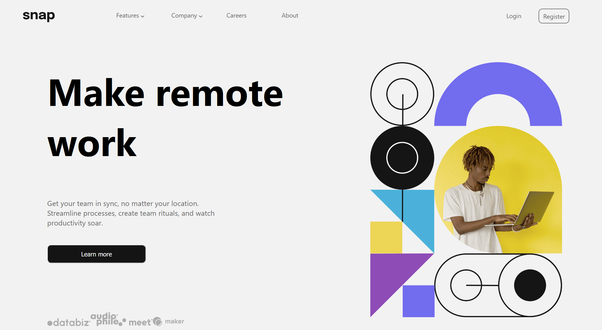

# Frontend Mentor project - Intro section

[Frontend Mentor](https://www.frontendmentor.io) challenges help me improve my coding skills by building realistic projects.

To completed this project I use React app and sass css.

- Here is design for desktop from Frontend Mentor:

- This is my screenshot:

All challenge on https://zalewskaewa7.github.io/Intro-section/
